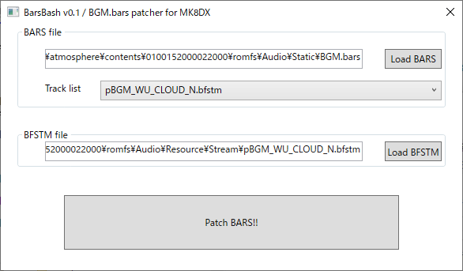

# BarsBash

 

This tool helps you to music hack for [MK8DX](https://www.nintendo.co.jp/switch/aabpa/index.html).

**Games other than MK8DX are not supported.**

It is easy to patch to `/romfs/Audio/Static/BGM.bars`, which is necessary when modifying BFSTM.

Requirements for BFSTM.
 * little endian
 * PCM_16 or DSP_ADPCM